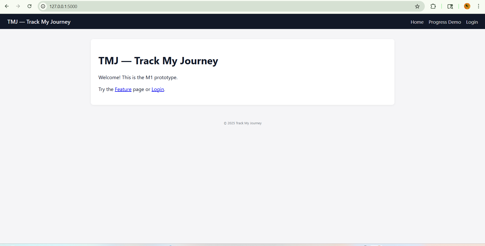
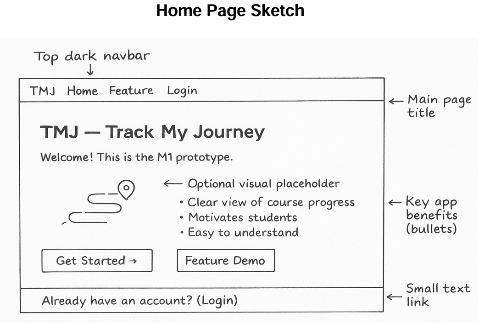
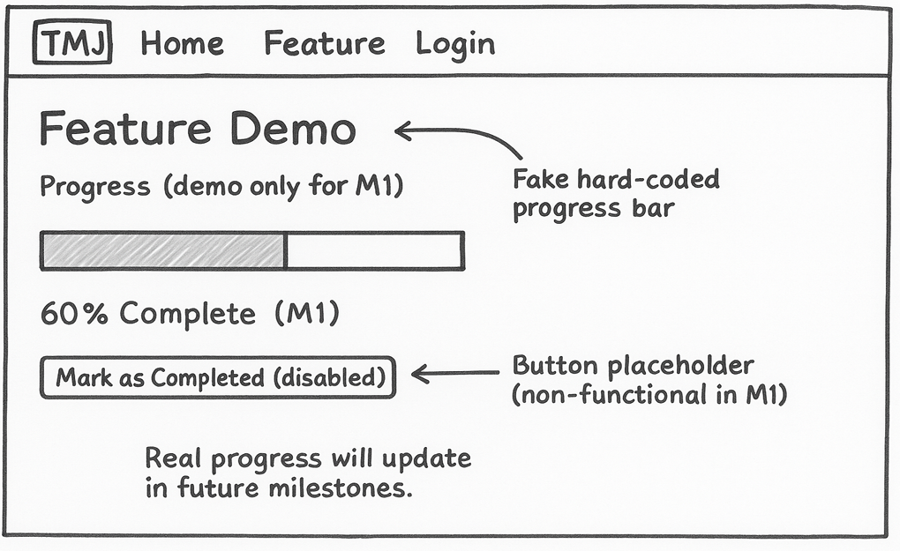
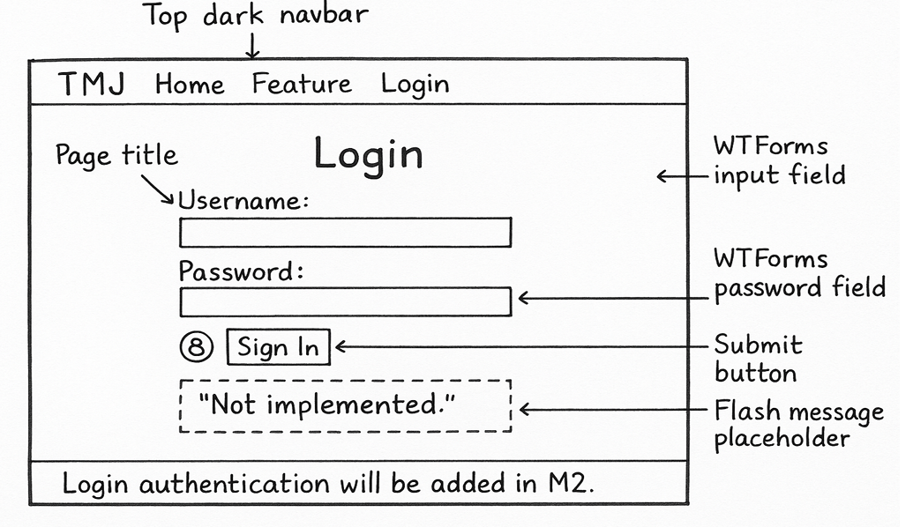
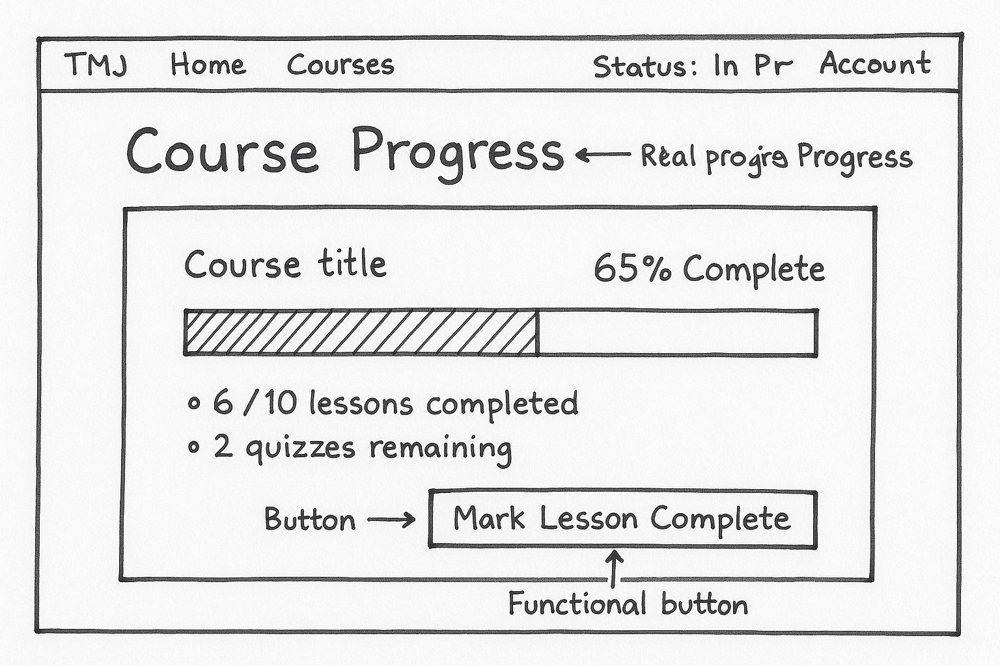
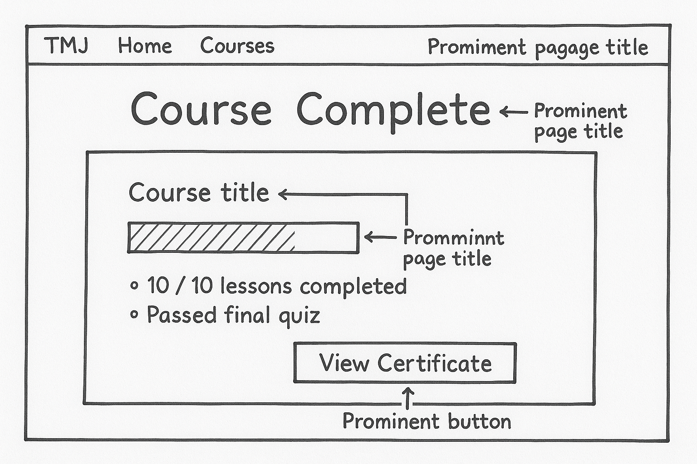
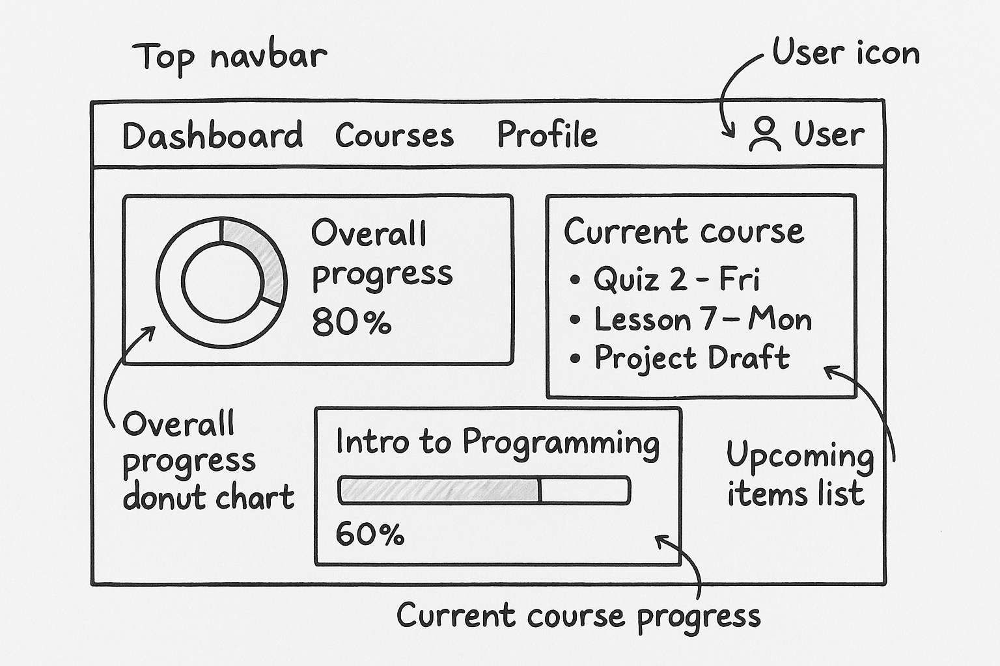

# TMJ — Track My Journey

## 📘 Overview

TMJ (Track My Journey) is a simple Learning Management System (LMS) prototype focused on progress visibility.

This Milestone 1 version is a non-functional Flask scaffold that demonstrates the app’s architecture and design setup.

It includes basic routes, templates, and a static progress bar to visualize the concept.

---

## 🚀 How to Run Locally

1.  **Clone the repository**
    ```bash
    git clone [https://github.com/ThaoHuynh94/tmj-lms.git](https://github.com/ThaoHuynh94/tmj-lms.git)
    cd tmj-lms
    ```

2.  **Create and activate a virtual environment**
    ```bash
    python -m venv .venv
    
    # (Mac/Linux)
    source .venv/bin/activate
    
    # (Windows)
    .venv\Scripts\activate
    ```

3.  **Install dependencies**
    ```bash
    pip install -r requirements.txt
    ```

4.  **Run the app**
    ```bash
    python run.py
    ```
    Then open your browser and go to:
    👉 [http://127.0.0.1:5000/](http://127.0.0.1:5000/)

---

## 🧱 Tech Stack

* **Flask** — web framework
* **Flask-SQLAlchemy** — ORM with SQLite (non-functional stub for M1)
* **Flask-Login** — user management (wired but non-functional)
* **Flask-WTF** — form handling
* **HTML / CSS / Jinja2** — templates and styling

---

## 🗂️ Project Structure

```
app/
├── __init__.py
├── config.py
├── models.py
├── forms.py

├── auth/
│   ├── __init__.py
│   ├── routes.py
│   └── templates/auth/
│       └── login.html

├── main/
│   ├── __init__.py
│   ├── routes.py
│   └── templates/main/
│       ├── index.html
│       ├── feature.html
│       └── course_detail.html   ← NEW (M2)
│
├── templates/
│   └── base.html

└── static/
    ├── styles.css
    ├── img/                    ← NEW
    │   ├── tmj-logo.png
    │   ├── course-python.png
    │   ├── completion-badge.png
    │   ├── feature-hero.png
    │   └── any other course thumbnails…
    │
    ├── video/                  ← NEW
    │   ├── login-hero.mp4
    │   └── optional future videos…
    │
    └── js/ (optional)          ← if needed JS later

```

---
## 🔐 Login Page Flow


```
(base.html)
   ↑
   │ extends
(login.html) ←──── render_template() ←──── (auth/routes.py) ←──── (forms.py)
   │
   │ inherits from base.html (nav, flash messages)
   │
   └── needs SECRET_KEY from config.py (for FlaskForm CSRF)

```

### Explanation:

- base.html provides shared layout (nav + flash messages).

- login.html extends base.html and renders the LoginForm.

- auth/routes.py handles /auth/login (GET shows form, POST validates and flashes).

- forms.py defines the LoginForm fields and validation.

- config.py supplies SECRET_KEY for CSRF protection used by Flask-WTF.

---

## 💡 Features (Milestone 1)

* Flask app runs with no errors
* Routes `/`, `/feature`, `/auth/login` render correctly
* WTForms login form validates and flashes “Login not implemented.”
* Static progress bar demo (60 %)
* Base template with navigation and flash message area
* SQLite + SQLAlchemy configured but not used yet
* as well as in new contributions updated the base.html to use new structure
* styles.css was adjusted with an expanded layout (nav, flashes, progress bar)
* uploaded the screenshots to //docs and updated the pages that had changes

---

## 🎯 Next Steps

* **M2:** Connect database and calculate real progress dynamically
* **M3:** Add dashboards for students and instructors

---

## 📸 Screenshot

Here’s the M1 prototype running locally:


#### Home Page


#### Feature Page


#### Login Page


#### Login Not implemented


---

# 🖼️ UI Sketches (All Milestones)

Below are the wireframes for TMJ, illustrating the planned UI layout for all project milestones.

---

## **Milestone 1 — Basic Static UI Layout**

### **Home Page Sketch**


### **Feature Demo Sketch**


### **Login Page Sketch**


---

## **Milestone 2 — Dynamic Course Progress Pages**

### **Course In Progress**
_Shows real-time completion values using database data._
<br>


### **Course Completed**
_Displays when a student finishes all lessons and objectives._
<br>


---

## **Milestone 3 — Student Dashboard**

### **Student Dashboard Sketch**
_Overall progress summary, current course details, and upcoming tasks._
<br>


---

## 👥 Team TMJ's Roles (M1)
- **Thao (T)** – Project Lead / Architect: repo setup, `create_app()`, blueprints, README.  
- **Mareli (M)** – Frontend: HTML templates, CSS, progress bar layout.  
- **Jacob (J)** – Backend: WTForms LoginForm, models, form validation logic.

---

## ✅ Milestone 1 Deliverables:

* One-page concept summary (PDF)
* Working Flask scaffold (HTML stubs only)
* Tagged repo release `m1`


